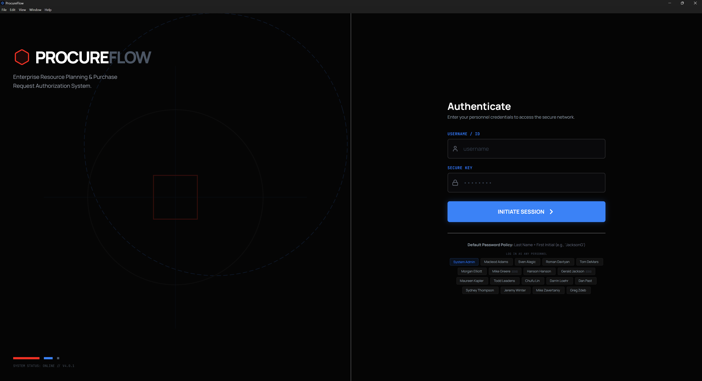
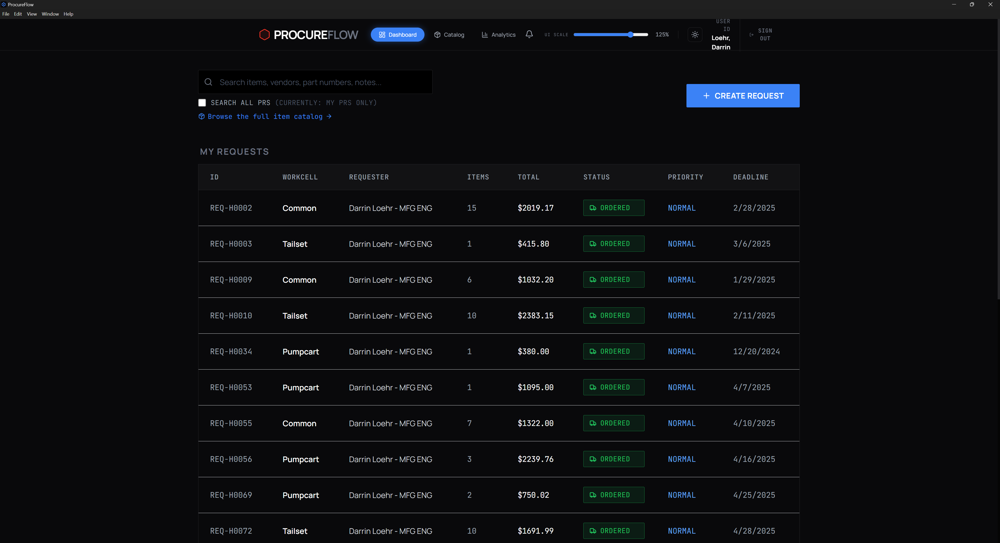
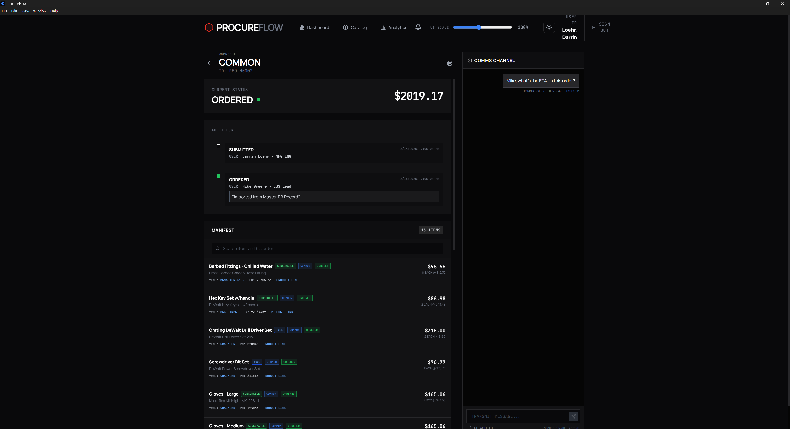
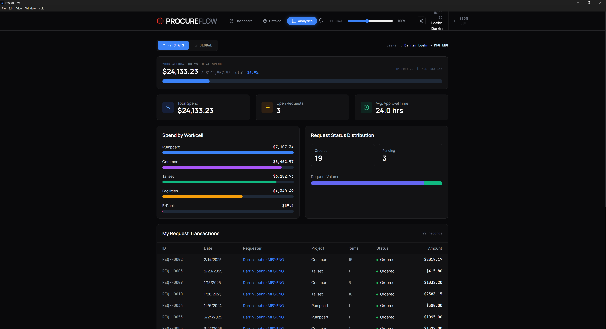

# ProcureFlow

**Enterprise Resource Planning & Purchase Request Authorization System**

ProcureFlow is a purchase-request management application for manufacturing teams. It
turns a messy pile of historical purchase-request spreadsheets into a fast, searchable,
analytics-driven workflow — available as a web app and a distributable Windows desktop
build.

---

## Highlights

- **Role-based workflow** — Employees submit requests; ESS reviews, orders, and receives them; Admins manage users.
- **Item Catalog** — every line item ever ordered, flattened into one searchable table with fuzzy matching across names, descriptions, vendors, and part numbers.
- **Powerful filtering** — filter by workcell, requester, supplier, item type, status, unit-price range, and date range. Every cell is clickable to drill down instantly.
- **Consumable vs. Tool classification** — color-coded so reorder-often consumables (screws, wire, gloves, fittings) are distinct from durable tools.
- **Analytics** — personal and global spend, spend-by-workcell, status distribution, and approval-time metrics, with clickable charts that jump into the catalog.
- **Persistent highlighting** — search terms stay highlighted as you navigate from the catalog into individual requests.
- **Light / Dark theme** toggle and an adjustable **UI scale** slider.
- **Offline-first desktop build** — Tailwind and fonts are bundled, so it runs without an internet connection.

---

## Screenshots

### Login & First-Time Sign-In



### Dashboard (Dark & Light)



### Item Catalog — Fuzzy Matching


### Request Detail — Manifest


### Analytics (Personal & Global)



---

## Tech Stack

| Layer | Technology |
|-------|-----------|
| UI | React 19 + TypeScript |
| Styling | Tailwind CSS (bundled via PostCSS) |
| Build | Vite 6 |
| Desktop | Electron 33 + electron-builder |
| Icons | lucide-react |
| Fonts | Manrope + JetBrains Mono (self-hosted via @fontsource) |

---

## Getting Started (Development)

```bash
npm install      # install dependencies
npm run dev      # start the dev server at http://localhost:3000
```

### Demo logins

Use any of the personnel quick-login buttons on the sign-in screen. The default password
policy is **Last Name + First Initial** (e.g. `JacksonG`).

---

## Building the Desktop App

A reproducible build script packages the app into a Windows installer and a portable build:

```powershell
./build-desktop.ps1            # full build -> installer in ./release
./build-desktop.ps1 -Run       # build the web bundle then launch Electron (no packaging)
./build-desktop.ps1 -SkipInstall   # skip npm install if deps already present
```

Artifacts are written to `release/`:

- `ProcureFlow Setup 0.0.0.exe` — Windows NSIS installer
- `win-unpacked/ProcureFlow.exe` — portable build (no install required)

> The app icon and splash screen are generated automatically via `npm run icon`.

---

## Project Structure

```
App.tsx                 # Root component, navigation, theme & UI-scale state
index.tsx               # Entry point (imports bundled CSS)
index.css               # Tailwind directives, theme tokens, self-hosted fonts
components/
  Dashboard.tsx         # Request list, search, workcell drill-down
  ItemExplorer.tsx      # Flattened searchable item catalog with filters
  RequestDetail.tsx     # Single request view + manifest search
  Analytics.tsx         # Spend & status analytics with clickable charts
  RequestForm.tsx       # Create / edit a request
  Login.tsx             # Authentication screen
  AdminPanel.tsx        # User management
services/
  db.ts                 # LocalStorage-backed data layer
  historicData.ts       # Normalized seed data (generated from spreadsheets)
  itemCategory.tsx      # Consumable/Tool classification + Highlight component
electron/
  main.cjs              # Electron main process + splash window
  preload.cjs           # Secure preload bridge
  splash.html           # Animated loading splash
scripts/
  generate-icon.mjs     # Generates app icon (PNG) + favicon (SVG)
build-desktop.ps1       # Reproducible desktop build script
```

---

## Notes

- Data is seeded from a normalized version of the Master PR Record and persists in the
  browser's localStorage. Clearing site data resets to the seed.
- This is a demo application; authentication and the "password policy" are illustrative,
  not production security.
